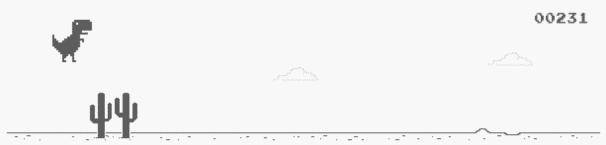

# Chome Dinosaur ML

 

A simple AI to teach Chrome's dinosaur to jump obstacles using genetic algorithm and neural networks.

## Installation and Execution

* Install dependencies: `pip install -r requirements.txt`
* Running the AI: `python ai.py`
* For Mac OS systems only. Unless, you tweak the code!

